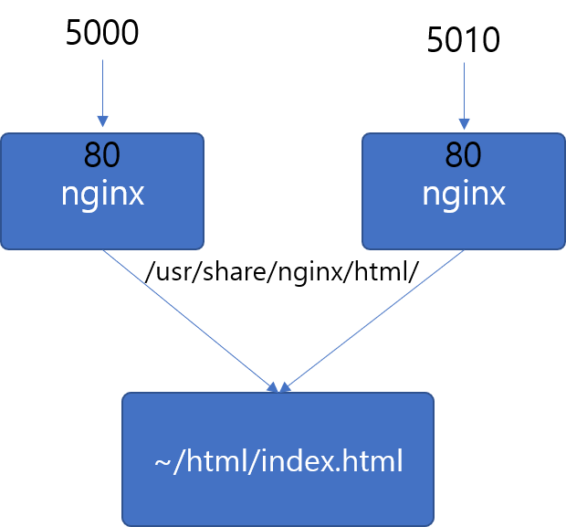

# 도커 실행


## 도커 설치

먼저 도커를 설치합니다.
`Ubuntu 18.04`에서는 별다른 작업 없이 아래와 같이 바로 도커를 설치할 수 있습니다.

```bash
sudo apt-get update
sudo apt-get install -y docker.io python3-dev python3-pip
sudo usermod -aG docker $USER
```


### `docker run`
첫 컨테이너를 실행시켜 보겠습니다.

```bash
# docker run $REPO/$IMAGE_NAME:$TAG [$PARAMETERS..]
docker run docker/whalesay cowsay 'hello world!'
#  ______________
# < hello world! >
#  --------------
#     \
#      \
#       \
#                     ##        .
#               ## ## ##       ==
#            ## ## ## ##      ===
#        /""""""""""""""""___/ ===
#   ~~~ {~~ ~~~~ ~~~ ~~~~ ~~ ~ /  ===- ~~~
#        \______ o          __/
#         \    \        __/
#           \____\______/
# 
```

$TAG를 생략시 자동으로 `latest` tag가 설정됩니다.

```bash
# docker run $REPO/$IMAGE_NAME:$TAG [$PARAMETERS..]
docker run docker/whalesay:latest cowsay 'hello world!'
```

```bash
docker/whalesay == docker/whalesay:latest
```

다른 파라미터를 전달해 봅시다. (`echo hello`)

```bash
docker run docker/whalesay:latest echo hello
# hello
```

`--name` 옵션으로 이름을 부여할 수도 있습니다.

```bash
# container with name `hello`
docker run --name hello docker/whalesay cowsay 'hello world!'
```

이미지 실행시 `-d` 옵션으로 통해 컨테이너를 백그라운드로 실행시킬 수도 있습니다.

```bash
# alpine이라는 이미지를 다음 파라미터로 실행  `sh -c "while true; do echo hello world; sleep 1; done`
# docker run에서 이미지가 없을 시, 자동으로 원격 저장소에서 이미지를 가져옵니다.
docker run -d ubuntu sh -c "while true; do echo hello world; sleep 1; done"
```
*`-d`옵션을 통해 컨테이너 실행시, 컨테이너ID가 리턴됩니다.*

### `docker ps`

방금 실행한 컨테이너의 ID를 확인해 보겠습니다.

```bash
docker ps

# CONTAINER ID     IMAGE      COMMAND         CREATED         ...
# cbf17c6cf502     ubuntu     "sh -c .."      2 minutes ago   ...
```
*`CONTAINER_ID`는 사용자마다 다릅니다.*

### `docker logs`

백그라운드로 실행된 컨테이너의 로그를 직접 확인할 수 있습니다.
```bash
# docker logs -f $CONTAINER_ID

docker logs -f cbf17c6cf502
```

### `docker stop`

백그라운드로 실행된 컨테이너를 멈춥니다.
```bash
docker stop cbf17c6cf502
```

컨테이너를 멈추게 되면
`docker ps`에는 보이지 않지만 `-a` 옵셥을 전체 컨테이너를 확인할 수 있습니다.
```bash
docker ps -a
```

### `docker rm`

남아있는 컨테이너를 삭제합니다.
```bash
docker rm cbf17c6cf502
```

### `docker exec`

`exec` 명령어는 실행된 컨테이너에 명령을 보내는 기능을 담당 합니다.
먼저 nginx 컨테이너를 하나 실행해 보겠습니다.

```bash
docker run -d nginx
```
`docker ps`를 통해 컨테이너ID를 획득 후, `exec`명령을 통해 `curl`을 설치해 보겠습니다.

```bash
docker ps
# Get CONTAINER_ID

docker exec $COND_ID apt update
docker exec $COND_ID apt install -y curl
docker exec $COND_ID curl localhost
```

### `docker cp`

컨테이너 내부와 호스트서버 간의 파일을 복사해 줍니다.

```bash
# 호스트에서 컨테이너로 파일 복사
docker cp /etc/passwd $COND_ID:/usr/share/nginx/html/.
# 확인
docker exec $COND_ID curl localhost/passwd

# 컨테이너에서 호스트로 파일 복사
docker cp $COND_ID:/usr/share/nginx/html/index.html .
# 확인
ls -al .
```


### Interactive 컨테이너

이미지를 실행시, `-it` 옵션을 통해 직접 컨테이너에 접속하여 작업할 수도 있습니다.
컨테이너 생성과 함께 접속
```bash
docker run -it ubuntu:18.04 bash

# inside container
$ root@1c23d59f4289:/#
```

혹은 먼저 컨테이너를 실행 시킨 뒤, 컨테이너 접속

```bash
docker run -d nginx

# 컨테이너ID 확인
docker ps 

docker exec -it $COND_ID bash
# inside container
$ root@1c23d59f4289:/#
```

### `docker commit`

실행 중인 컨테이너에 새로운 이미지(snapshot)을 생성합니다.

```bash
# nginx image without curl
docker run -d nginx
# install curl
docker exec $COND_ID apt update
docker exec $COND_ID apt install -y curl
# commit
docker commit $COND_ID nginx:curl

# run nginx with curl
docker run -d nginx:curl
```

---

## :trophy: Do it more #1

`ubuntu:18.04` 이미지를 이용하여 nginx 서버를 설치하고 아래와 같이 첫페이지가 나오는 `my-first-img`라는 이미지를 생성해 주세요.

```bash
# run my-first-img
docker run -d my-first-img nginx -g 'daemon off;'
# curl localhost
docker exec $COND_ID curl localhost
```

```html
<html>
    <body>
        <h1>Hello world!</h1>
    </body>
</html>
```

## :trophy: Do it more #2

1. nginx 컨테이너를 2개 생성합니다. 각각 5000, 5010 포트를 컨테이너 내부 80포트에 바인딩합니다.
2. 두개 컨테이너는 동일하게 호스트의 `~/html` 디렉토리와 컨테이너 내부 `/usr/share/nginx/html/`를 볼룸 연결합니다.
3. 웹 브라우저에서 `$HOST_IP:5000`과 `$HOST_IP:5010`가 정상적으로 나오는지 확인합니다.

